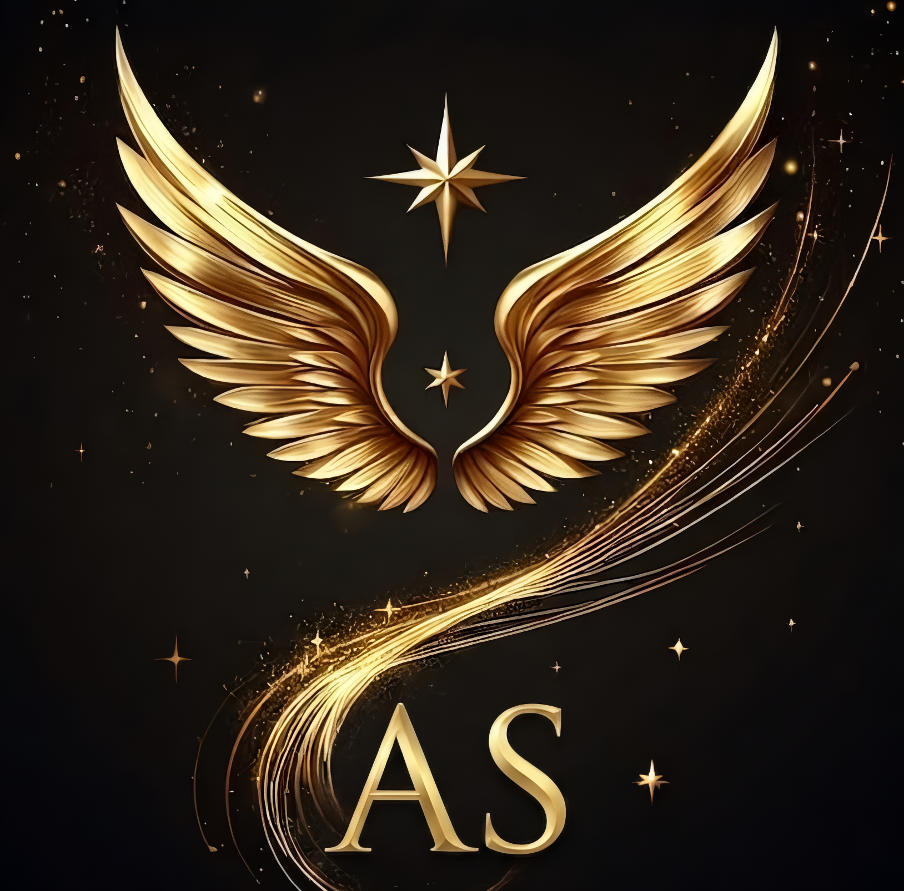

<div align="center">
  
  
  <br>
  
  <h1 align="center" style="font-size: 3.5rem; font-weight: 900; background: linear-gradient(135deg, #d4a847 0%, #f5d06b 40%, #ffffff 70%, #b8942e 100%); -webkit-background-clip: text; -webkit-text-fill-color: transparent; text-shadow: 0 0 50px rgba(212,168,71,0.3); letter-spacing: 4px;">
    ⚡ AETHRA STREAM
  </h1>
  
  <p align="center" style="font-size: 1.2rem; color: #e8e0d4; letter-spacing: 2px; font-weight: 300;">
    <b style="color: #d4a847; font-weight: 700;">Advanced Entertainment Hub</b><br>
    <span style="color: #a0968a;">Satu Platform, 4 Sumber Konten, Tanpa Iklan, Tanpa Ribet.</span>
  </p>

  <br>

  <p align="center">
    <a href="https://github.com/xeonradeon/aethra-stream/stargazers"></a>
    <a href="https://aethra-stream.vercel.app"></a>
    <a href="https://github.com/xeonradeon/aethra-stream/blob/main/LICENSE"></a>
  </p>

  <p align="center">
    
    
    
    
    
  </p>

  <p align="center">
    
    
  </p>
</div>

---

## 🌟 Why AETHRA STREAM?

> AETHRA STREAM adalah platform hiburan digital all-in-one yang dibangun dari nol.  
> Menggabungkan **Anime, Donghua, Komik, dan Movie** dalam satu dashboard premium.  
> Tidak perlu buka 4 tab browser lagi. Cukup satu platform.

---

## ✨ Fitur Unggulan

| 🎯 Fitur | 📝 Deskripsi |
|---------|-------------|
| **4 Sumber Terintegrasi** | Anime, Donghua, Komik, Movie dalam satu dashboard. |
| **Live Stats Dashboard** | Pantau total konten dan status scraper secara real-time. |
| **Trending Mix Carousel** | Konten trending dari semua sumber dalam satu slider dinamis. |
| **Gold Glassmorphism UI** | Desain dark elegan dengan aksen emas dan efek kaca premium. |
| **PWA (Progressive Web App)** | Install di HP/PC seperti aplikasi native. |
| **Global Search** | Cari judul favorit dari semua sumber sekaligus. |
| **Hybrid Architecture** | Frontend Vercel (cepat) + Proxy Komik Railway (anti-block). |

---

## 🛠️ Tech Stack

| Layer | Teknologi |
|-------|-----------|
| **Frontend** | Next.js 15 (App Router), React 19, TypeScript |
| **Styling** | Tailwind CSS 4, Framer Motion, Lucide Icons |
| **State & Hooks** | React Hooks, Custom Hooks (useBookmark, useWatchHistory) |
| **Scraper Anime/Donghua/Movie** | Di Vercel (langsung, tanpa proxy) |
| **Scraper Komik** | Proxy via Railway (mencegah block) |
| **Deployment** | Vercel (Frontend) + Railway (Proxy Komik) |

---

## 🎨 Design System

```css
/* AETHRA STREAM Design System */
{
  background: #0a0a0a;
  card: #141414;
  border: #2a2a2a;
  gold: #d4a847;
  text-primary: #e8e0d4;
  text-muted: #8a8278;
  glass: backdrop-filter: blur(16px);
  glow: 0 0 40px rgba(212,168,71,0.14);
}
```

✨ Glassmorphism + Gold Glow = Identitas visual yang mewah dan futuristik.

---

📂 Project Structure (Production)

```text
aethra-stream/
├── app/                    # Next.js App Router
│   ├── api/               # API Routes
│   │   ├── scraper/       # Scraper anime/donghua/movie & proxy komik
│   │   └── stats/         # Live stats aggregator
│   ├── dashboard/         # Dashboard pages (Anime, Donghua, dll.)
│   ├── layout.tsx         # Root layout
│   ├── page.tsx           # Redirect ke dashboard
│   ├── error.tsx          # Global error
│   ├── loading.tsx        # Global loading
│   └── not-found.tsx      # 404 page
├── components/            # Reusable UI Components
├── hooks/                 # Custom Hooks
├── lib/                   # Scrapers & Utilities
│   ├── scrapers/          # Scraper engines
│   │   ├── anime/         # Samehadaku (Vercel)
│   │   ├── donghua/       # Donghub (Vercel)
│   │   ├── komik/         # Komikindo (via Railway proxy)
│   │   └── movie/         # Filem21 (Vercel)
│   └── utils.ts           # Helper functions
├── public/                # Static assets (Logo, PWA)
├── types/                 # TypeScript definitions
└── vercel.json            # Vercel deployment config
```

---

🚀 Run Locally

```bash
git clone https://github.com/xeonradeon/aethra-stream.git
cd aethra-stream
npm install
npm run dev
# Open http://localhost:3000
```

---

📡 Hybrid Architecture (How It Works)

```mermaid
graph TD
    U[User] --> V[Vercel Frontend]
    
    V -->|Scrape Langsung| A[Anime / Donghua / Movie]
    A --> V
    
    V -->|Proxy Request| R[Railway Komik Proxy]
    R -->|Scrape| K[Komikindo]
    K --> R
    R --> V
    
    V --> U

    style V fill:#0a0a0a,stroke:#d4a847,stroke-width:2px
    style R fill:#0a0a0a,stroke:#9B49B6,stroke-width:2px
    style A fill:#1a1a1a,stroke:#666,stroke-width:1px
    style K fill:#1a1a1a,stroke:#666,stroke-width:1px
```



🔹 Why Hybrid?

· Vercel: Handle Anime, Donghua, Movie super cepat (langsung).
· Railway: Handle Komik (satu-satunya yang diblokir Vercel).

---

🤝 Kontribusi & Lisensi

Project ini adalah open-source personal project.
Kamu bebas fork, modify, dan deploy untuk keperluan pribadi.
Dilarang menjual ulang atau mengklaim sebagai karya sendiri.

---

📬 Kontak & Dukungan

· Developer: xeonradeon
· Live App: aethra-stream.vercel.app
· Issue / Bug Report: Silakan buka issue di GitHub repo.

---

<div align="center">
  <br>
  <p style="color: #8a8278; font-size: 13px; letter-spacing: 2px; font-family: monospace;">
    © 2026 AETHRA STREAM · Built with 『 𓅯 』𝙭𝙚𝙤𝙣 - 𝙧𝙖𝙙𝙚𝙤𝙣.
  </p>
</div>